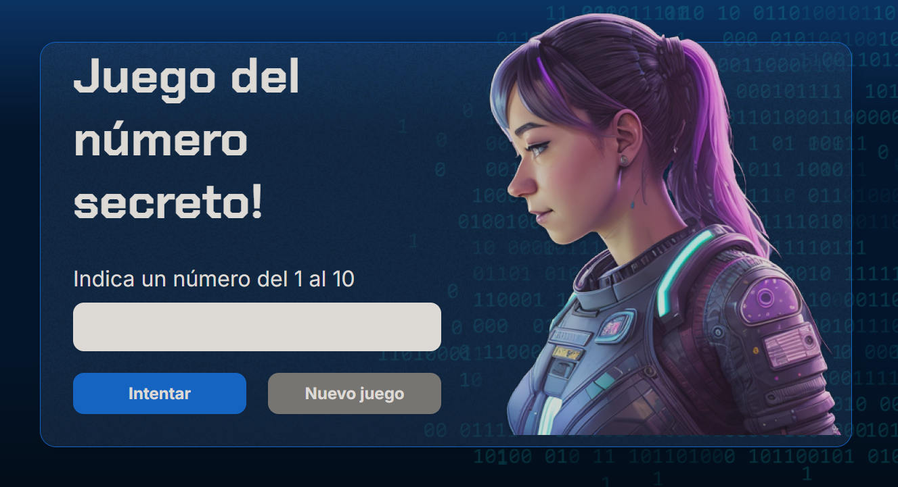

<div align="center">

## | EN 🎮 Secret number game | ES 🎮 Juego del número secreto | 
[EN English](#en-english) | [ES Español](#es-español) </br>
[[Demo](https://celesteamador.me/juego-secreto/)]


</div>

## [EN English](#-english)

### Description  
A simple web game developed in JavaScript that challenges the user to guess a randomly generated secret number. 
The player receives immediate feedback (“too high,” “too low”) until they find the correct answer.
The conditions of the game are as follows:
- You have to guess a number between 1 and 10.
- You have a maximum of 5 attempts to guess the number.
- When you reach the maximum number of attempts, a banner appears with the following message: “You have reached the maximum number of 5 attempts.”

### 🎯 Game Rules
1. 🎲 Guess a number between 1-10
2. 🔄 Maximum 5 attempts
3. 💡 Get hints: "too high" or "too low"
4. 🏆 Win by guessing correctly!

### ⚙️ Technologies used  
- **HTML5** - Application structure (frontend)
- **CSS3** - Style and responsive design  (frontend)
- **JavaScript (ES6+)** - Game logic (backend) 

### ✨ Features  
- Random generation of the secret number  
- Interactive interface with dynamic messages  
- Player attempt counter
- Button to restart the game

### 📸 Screenshot


### Project structure
```
juego-secreto/
├─ img/
│   ├─ bg.png
│   ├─ code.png
│   ├─ ia.png
│   ├─ Ruido.png
│   └─ screenshots/
│       └─ image.png
├─ app.js
├─ index.html
├─ style.css
└─ README.md
```

### What I learned  
- Real-time DOM manipulation  
- Game logic using JavaScript conditionals and loops  
- Best practices for separation: structure (HTML), presentation (CSS), and logic (JS)  
- Creating simple interactive experiences for the web.

### 🚀 Installation & usage  
1. Clone the repository:  
```bash
git clone https://github.com/celesteamador/juego-secreto.git
cd juego-secreto
  ```
2. Open `index.html` in your browser or use a local HTTP server
- Local HTTP server with Python
```bash
# From the project folder
python -m http.server 8000
# Then open http://localhost:8000
  ```
- Local HTTP server with Node:
```bash
npm i -g http-server
http-server -p 8000
# Open http://localhost:8000
  ```

### 🎮 Demo
- [Play here](https://celesteamador.me/juego-secreto/)

### 📄 License
This project is licensed under the MIT license.


## [ES Español](#-español)

### Descripción  
Juego web sencillo desarrollado en JavaScript que reta al usuario a adivinar un número secreto generado aleatoriamente. 
El jugador recibe retroalimentación inmediata ("muy alto", "muy bajo") hasta encontrar la respuesta correcta.
Las condiciones del juego son las siguientes:
- Se tiene que adivinar un número de entre el 1 al 10.
- Se tiene un máximo de 5 intentos para adivinar el número.
- Al alcanzar el máximo número de intentos aparece un banner con el siguiente mensaje: "Llegaste al número máximo de 5 intentos"

### 🎯 Reglas del juego
1. 🎲 Adivina un número entre 1 y 10.
2. 🔄 Máximo 5 intentos.
3. 💡 Obtén pistas: «demasiado alto» o «demasiado bajo».
4. 🏆 ¡Gana adivinando correctamente!

### ⚙️ Tecnologías utilizadas  
- **HTML5** - Estructura de la aplicación (frontend)
- **CSS3** - Estilo y diseño responsivo  (frontend)
- **JavaScript (ES6+)** - Lógica del juego (backend) 

### ✨ Características  
- Generación aleatoria del número secreto  
- Interfaz interactiva con mensajes dinámicos  
- Contador de intentos del jugador
- Botón para reiniciar el juego

### 📸 Captura de pantalla


### Estructura del proyecto
```
juego-secreto/
├─ img/
│   ├─ bg.png
│   ├─ code.png
│   ├─ ia.png
│   ├─ Ruido.png
│   └─ screenshots/
│       └─ image.png
├─ app.js
├─ index.html
├─ style.css
└─ README.md
```

### Lo que aprendí  
- Manipulación del DOM en tiempo real  
- Lógica de juego usando condicionales y bucles en JavaScript 
- Buenas prácticas de separación: estructura (HTML), presentación (CSS) y lógica (JS)  
- Creación de experiencias interactivas simples para la web.

### 🚀 Instalación & uso  
1. Clona el repositorio:  
```bash
git clone https://github.com/celesteamador/juego-secreto.git
cd juego-secreto
  ```
2. Abre `index.html` en tu navegador o utiliza un servidor HTTP local
- Servidor HTTP local con Python
```bash
# Desde la carpeta del proyecto
python -m http.server 8000
# Luego abre http://localhost:8000
```
- Servidor HTTP local con Node:
```bash
npm i -g http-server
http-server -p 8000
# Abre http://localhost:8000
```

### 🎮 Demo
- [Juega aquí](https://celesteamador.me/juego-secreto/)

### 📄 Licencia
Este proyecto está bajo la licencia MIT.
